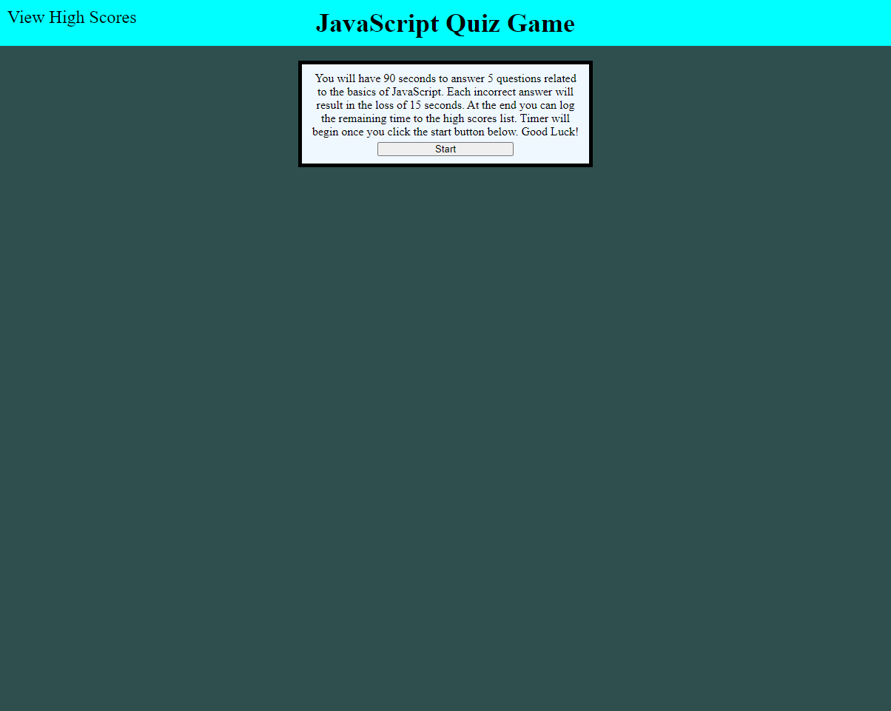

# JavaScript Quiz Game

## Game Description
A simple JavaScript quiz game that players the user multiple choice question on basic jS knowledge.  Game is time with 15 seconds being subtracted for each incorrect answer.  At the end of the game the players time remaining is given as the score which they can save to local storage on their device. 
## Languages Used
HTML
CSS
JavaScript
## Website Snapshot
 
 
## Link to Web Page
https://mjd10m.github.io/jS-Quiz-Game/
